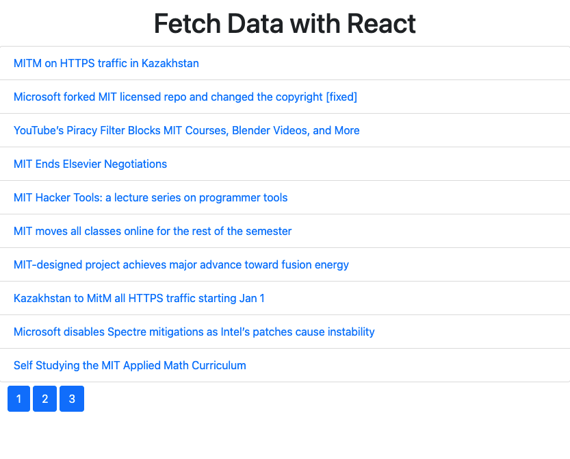

# Fetch Data
## This is a webapp built using react web components

TITLE:
FetchDataSolution

DESCRIPTION:
This application demonstrates how to use react fetch data and present it on a webpage.

HOW TO RUN:
The software is hosted on github here https://github.com/cincimatti/Fetch-News.
It can be reached at https://cincimatti.github.io/Fetch-News/index.html for live demonstrations.

UPDATES:
Update: A custom style sheet was added using CSS to modify default page settings.
Update: Additional text styling was added to center header.

ROADMAP:
New Features: No additional features have been roadmapped at this time.

OPERATING INSTRUCTIONS:
The web URL provided will open the webapp landing page. 
As the URL loads the webapp will pull data from a third-party news site and display it.
The app is designed to paginate the data on seperate pages with 10 items per page.

LICENSE INFORMATION: Licensing information can be found in the repo locate the "LICENSE" file.